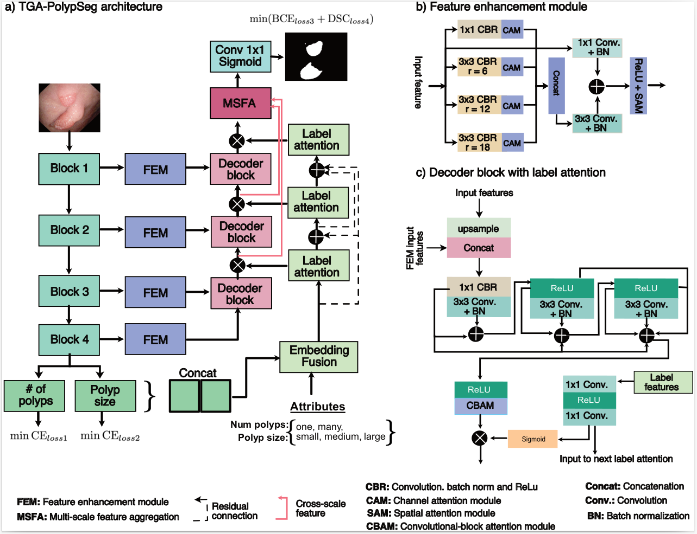
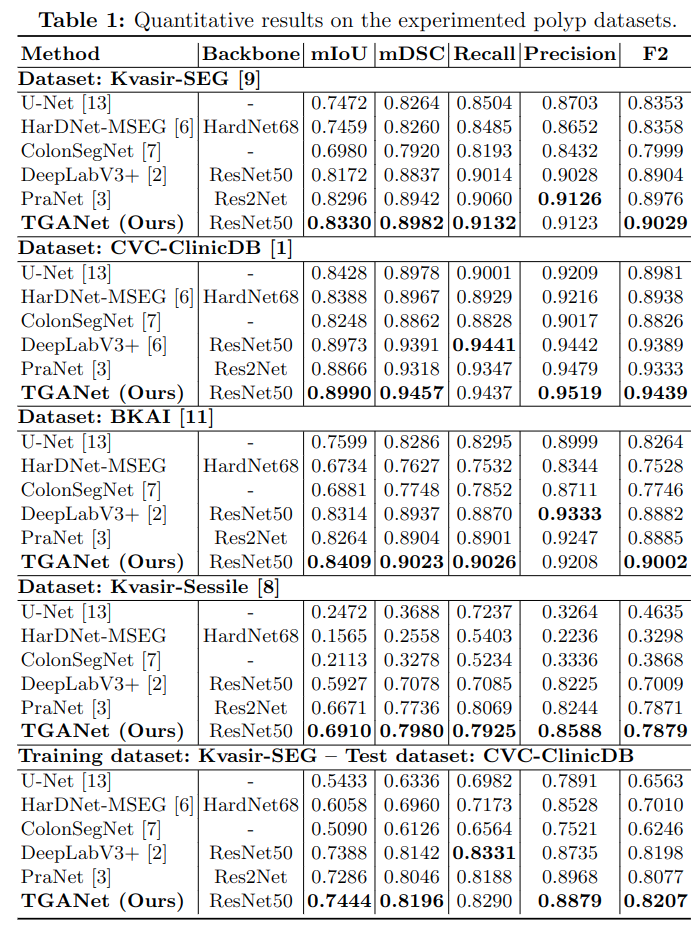
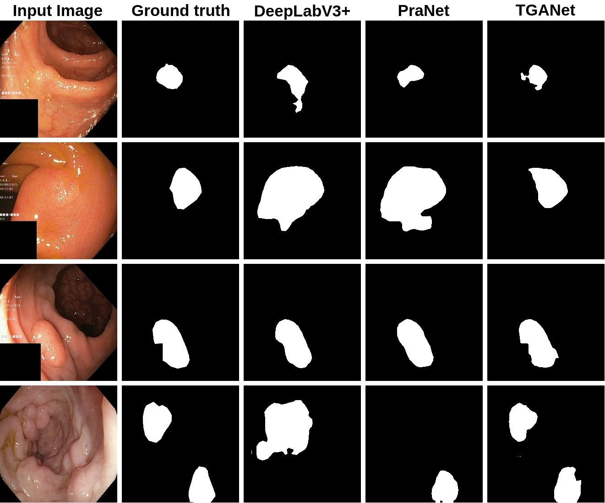

# TGANet: Text-guided attention for improved polyp segmentation

## Abstract
Colonoscopy is a gold standard procedure but is highly operator-dependent. Automated polyp segmentation, a precancerous precursor, can minimize missed rates and timely treatment of colon cancer at an early stage. Even though there are deep learning methods developed for this task, variability in polyp size can impact model training, thereby limiting it to the size attribute of the majority of samples in the training dataset that may provide sub-optimal results to differently sized polyps. In this work, we exploit *size-related* and *polyp number-related* features in the form of text attention during training. We introduce an auxiliary classification task to weight the text-based embedding that allows network to learn additional feature representations that can distinctly adapt to differently sized polyps and can adapt to cases with multiple polyps. Our experimental results demonstrate that these added text embeddings improve the overall performance of the model compared to state-of-the-art segmentation methods. We explore four different datasets and provide insights for size-specific improvements. Our proposed *text-guided attention network* (TGANet) can generalize well to variable-sized polyps in different datasets.

## Architecture

## Quantative Results

## Qualitative Results

## Citation
<pre>
@inproceedings{tomar2022,
title={TGANet: Text-guided attention for improved polyp segmentation},
author={Tomar, Nikhil Kumar and Jha, Debesh and Bagci, Ulas and Ali, Sharib},
booktitle={arXiv},
year={2022}
} 
</pre>

## Contact
Please contact nikhilroxtomar@gmail.com for any further questions. 
